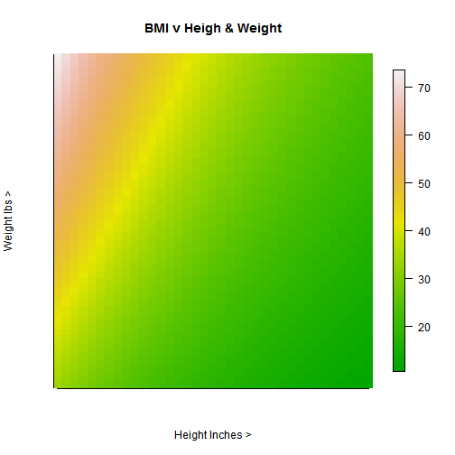

## The world is getting heavier

 
 

 Obesity in the western world has reached epidemic proportions. Excessive weight leads to many health problems. The first step in tackling this is to find out just how fat your are. One measure of this is BMI.     pto

--- &radio 

## Question 1

 What is BMI?

1. Belt-size*Mass/Inside-leg-length

2. _Weight/Height*Height_

3. Weight*Weight/Height

4. Waist-size/(Weight*Height)

*** .hint 
What are you asked about when claculating BMI?

*** .explanation 
BMI = Body Mass Index where Height is in metres and Weight in Kg

---

## Use my BMI App

Click <a href="https://johnmlilley.shinyapps.io/App1/">here</a> to go to my BMI Shiny App.
  
Well, wasn't that exciting!

---
## BMI plot

